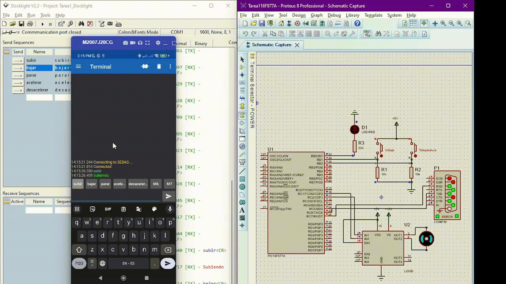

# DC Motor Control Using Microcontroller via Serial Port

## Introduction
This project simulates the control of a DC motor using a PIC microcontroller through serial communication. The simulation is designed in Proteus, enabling a comprehensive understanding of hardware and software interaction. The microcontroller accepts commands via a serial interface, allowing users to manipulate motor speed and direction while monitoring simulated fault conditions.

The program is developed in C using the CCS compiler, which includes functionality for receiving serial commands, generating PWM signals for motor control, and simulating fault scenarios such as overvoltage and overheating. The project serves as an educational tool for understanding motor control systems and microcontroller programming, and it can be expanded with additional features like advanced control algorithms and real-time monitoring.

  
  

## Components
- **Microcontroller**: PIC16F877A
- **Motor Driver**: L293D
- **DC Motor**
- **Resistors**: 10kΩ
- **LEDs**: For indication
- **Push Buttons**: For simulating faults
- **Software**:
  - CCS C Compiler
  - Docklight (for sending serial messages)
  - Virtual Serial Ports Emulator (VSPE) (to virtualize serial ports)
  - Serial Bluetooth Terminal (for Bluetooth control)

## Schematic Diagram
  

## Software
The code is written in C using the CCS compiler. The program includes routines for:
- Receiving serial commands
- Controlling motor speed and direction using PWM
- Handling simulated faults for overvoltage and overtemperature

## Hardware Setup
Describe how to connect the components, including:
- Power connections
- Microcontroller pin configurations
- Motor driver connections
- Button and LED setups

## Working
The system operates by sending serial commands (e.g., "subir" for increase speed, "bajar" for decrease speed) using Docklight. These commands are processed by the PIC microcontroller, which then adjusts the PWM signal sent to the L293D motor driver to control the motor's speed and direction. The system can also simulate faults, turning on indicators if an overvoltage or overheating condition occurs.

## Proteus Simulation
The simulation is built within Proteus, which allows for a realistic emulation of the circuit's behavior. Users can:
- Interactively control the motor using the virtual interface.
- Monitor the performance of the microcontroller and the motor driver in real time.
- Test various fault scenarios by activating virtual push buttons that simulate overvoltage and overheating conditions.
- Visualize the motor's response to different speed and direction commands without needing physical components, making it a safe and efficient learning tool.

## How to Run the Simulation
1. Open the Proteus simulation.
2. Use Docklight to send commands to the virtual COM port.
3. (Optional) Use the Serial Bluetooth Terminal app for Bluetooth control.

## Future Improvements
- Implementing more advanced control algorithms (like PID).
- Adding real-time data monitoring.
- Enhancing fault detection and recovery mechanisms.

